# 难度配置

**DVWA 的核心页面配置和初始化文件** 

/DVWA/includes/dvwaPage.inc.php

```
function dvwa_start_session() {
  
    $security_level = dvwaSecurityLevelGet();
    if ($security_level == 'impossible') {
        $httponly = true;
        $samesite = "Strict";
    }
    else {
        $httponly = false;
        $samesite = "";
    }

    $maxlifetime = 86400;
    $secure = false;
    $domain = parse_url($_SERVER['HTTP_HOST'], PHP_URL_HOST);


    if (session_status() == PHP_SESSION_ACTIVE) {
        session_write_close();
    }
	
	//设置会话cookie属性参数
    session_set_cookie_params([
        'lifetime' => $maxlifetime, //会话有效期
        'path' => '/',              //Cookie 的作用路径
        'domain' => $domain,        //Cookie 的作用域名
        'secure' => $secure,        //防止中间人窃听
        'httponly' => $httponly,    //防止 XSS 窃取
        'samesite' => $samesite     //防止 CSRF 攻击
    ]);

    if ($security_level == 'impossible') {
    	//启动新会话或恢复现有会话
        session_start();
        //重新生成会话 ID
        session_regenerate_id(); 
    }
    else {
    	//session_name()：默认为 "PHPSESSID"，可通过 'session_name()'获取
        if (isset($_COOKIE[session_name()])) // if a session id already exists
            session_id($_COOKIE[session_name()]); // we keep the same id
        session_start(); // otherwise a new one will be generated here
    }
}
```

- **Impossible 等级**：启用最高安全配置
  - `HttpOnly = true`：JavaScript 无法访问 Cookie，防 XSS 窃取
  - `SameSite = Strict`：完全禁止跨站请求携带 Cookie，防 CSRF
- **其他等级（Low/Medium/High）**：降低安全要求
  - `HttpOnly = false`：允许 JS 访问
  - `SameSite = ""`：不限制跨站请求

# 暴力破解（Brute Force）

## Low

### 源码分析

### 漏洞利用

## Medium

### 源码分析

### 漏洞利用

## High

### 源码分析

### 漏洞利用

## Impossible

### 源码分析

### 漏洞利用

# 命令注入（Command Injection）

## Low

### 源码分析

### 漏洞利用

## Medium

### 源码分析

### 漏洞利用

## High

### 源码分析

### 漏洞利用

## Impossible

### 源码分析

### 漏洞利用

# 跨站请求伪造（CSRF）

## cookie

**Cookie（HTTP Cookie）由服务器发送到用户浏览器并保存在本地，后续发送请求时自动携带它们，实现状态管理功能。**

**PHP中以超全局数组$_COOKIE表示**

1. **`$_GET`** - 获取 URL 参数（查询字符串）
2. **`$_POST`** - 获取表单 POST 数据
3. **`$_COOKIE`** - 获取 HTTP Cookie
4. **`$_SESSION`** - 访问会话数据
5. **`$_SERVER`** - 服务器和执行环境信息
6. **`$_REQUEST`** - 获取 GET、POST、Cookie 的混合数据
7. **`$_FILES`** - 获取上传的文件信息
8. **`$_ENV`** - 环境变量
9. **`$GLOBALS`** - 引用全局作用域中可用的全部变量


**$_COOKIE  1个默认键 + 若干个额外定义键**

```
$_COOKIE = [
    'PHPSESSID'     => 'abc123',
    'other'    =>'*****'
];
```

**例如DVWA配置文件中setcookie()函数定义了一个新的键名security**

```
function dvwaSecurityLevelSet( $pSecurityLevel ) {
	...
    setcookie( 'security', $pSecurityLevel, 0, "/", "", false, $httponly );
    $_COOKIE['security'] = $pSecurityLevel;
}
```


## Low

### 源码分析

```php
<?php

if( isset( $_GET[ 'Change' ] ) ) {
    // Checks to see where the request came from
    if( stripos( $_SERVER[ 'HTTP_REFERER' ] ,$_SERVER[ 'SERVER_NAME' ]) !== false ) {
        // Get input
        $pass_new  = $_GET[ 'password_new' ];
        $pass_conf = $_GET[ 'password_conf' ];

        // Do the passwords match?
        if( $pass_new == $pass_conf ) {
            // They do!
            $pass_new = ((isset($GLOBALS["___mysqli_ston"]) && is_object($GLOBALS["___mysqli_ston"])) ? mysqli_real_escape_string($GLOBALS["___mysqli_ston"],  $pass_new ) : ((trigger_error("[MySQLConverterToo] Fix the mysql_escape_string() call! This code does not work.", E_USER_ERROR)) ? "" : ""));
            $pass_new = md5( $pass_new );

            // Update the database
            $current_user = dvwaCurrentUser();
            $insert = "UPDATE `users` SET password = '$pass_new' WHERE user = '" . $current_user . "';";
            $result = mysqli_query($GLOBALS["___mysqli_ston"],  $insert ) or die( '<pre>' . ((is_object($GLOBALS["___mysqli_ston"])) ? mysqli_error($GLOBALS["___mysqli_ston"]) : (($___mysqli_res = mysqli_connect_error()) ? $___mysqli_res : false)) . '</pre>' );

            // Feedback for the user
            echo "<pre>Password Changed.</pre>";
        }
        else {
            // Issue with passwords matching
            echo "<pre>Passwords did not match.</pre>";
        }
    }
    else {
        // Didn't come from a trusted source
        echo "<pre>That request didn't look correct.</pre>";
    }

    ((is_null($___mysqli_res = mysqli_close($GLOBALS["___mysqli_ston"]))) ? false : $___mysqli_res);
}

?> 
```

- $GLOBALS["___mysqli_ston"] 

  数据库连接对象mysqli_connect("localhost", "user", "pass", "db");（DVWA中将该语句存入全局变量）

​	一般写成：$mysqli = ... 

**仅有的防护**

 **mysqli_real_escape_string()** **对$pass_new进行转义处理  一定程度上避免了SQL注入**


### 漏洞利用

一个更改密码的页面

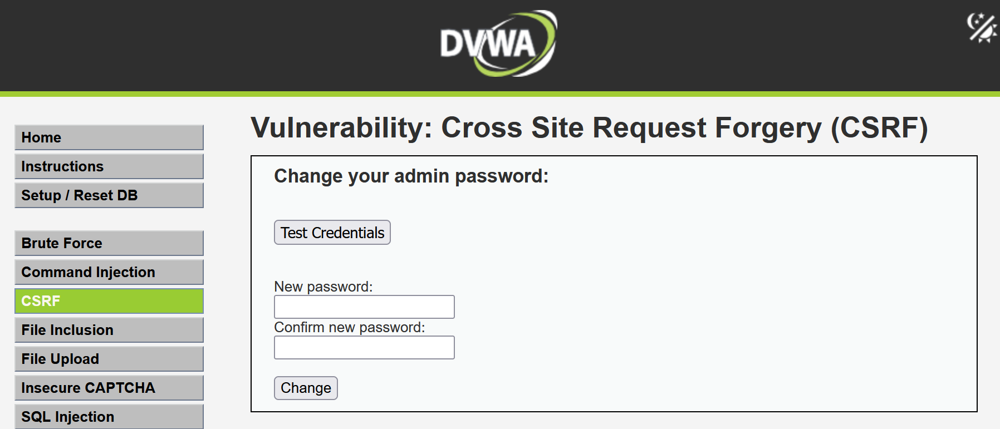

输入新密码并提交

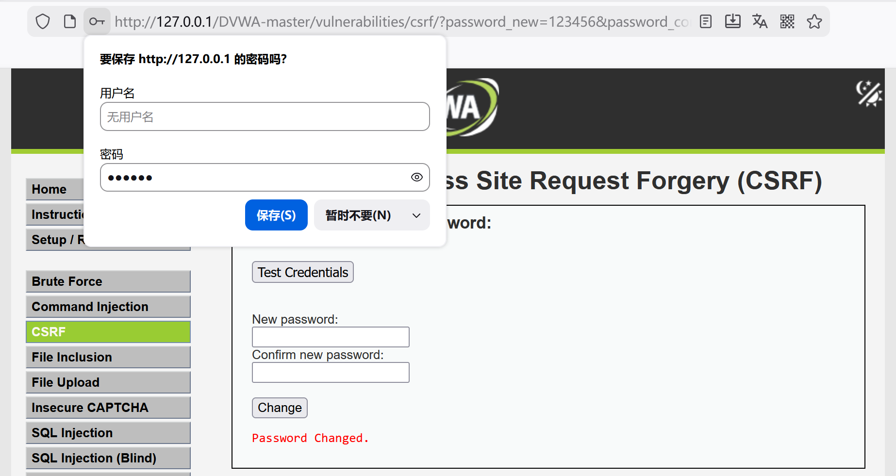

```
http://127.0.0.1/DVWA-master/vulnerabilities/csrf/?password_new=123456&password_conf=123456&Change=Change#
```

数据通过GET传参

构造包含更改密码654321的url （扮演攻击者）

```
http://127.0.0.1/DVWA-master/vulnerabilities/csrf/?password_new=654321&password_conf=654321&Change=Change#
```

新建一个页面并粘贴该url（扮演被诱导点击了该url的用户）

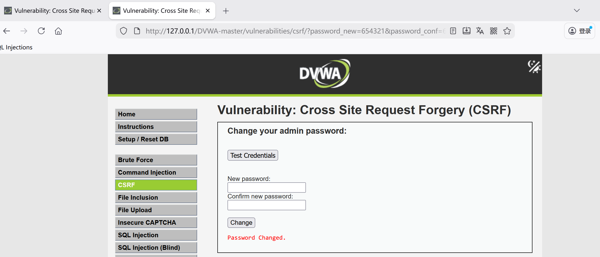

成功修改了密码


## Medium

### 小插曲That request didn't look correct

**正常进行更改密码流程但显示 That request didn't look correct.**

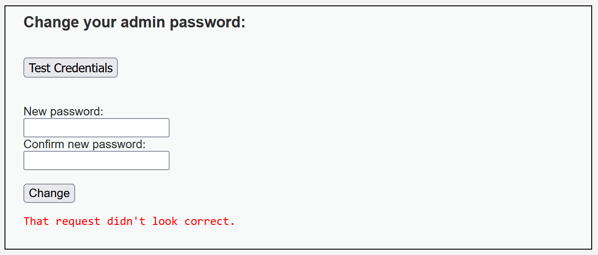

查看请求头 我们发现该请求头Referer字段包含了服务器名称SERVER_NAME

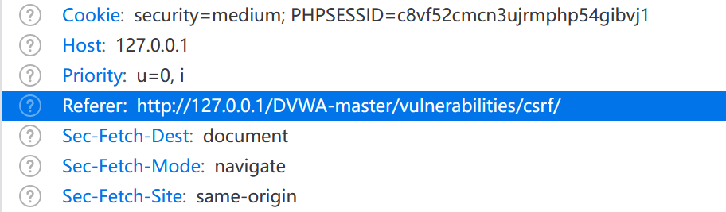

尝试1、退出并且重新从网站根目录进入 2、使用其他浏览器 

但都显示That request didn't look correct.

**最终解决**

 [http://127.0.0.1/.](http://127.0.0.1/DVWA-master/vulnerabilities/csrf/?password_new=123456&password_conf=123456&Change=Change#)..  =>  http://localhost/...


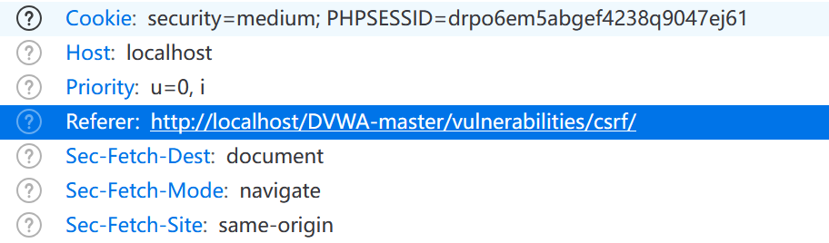

**服务器名称SERVER_NAME应该是localhost而不是127.0.0.1**


### 源码分析

```php
<?php

if( isset( $_GET[ 'Change' ] ) ) {
	// Checks to see where the request came from
	if( stripos( $_SERVER[ 'HTTP_REFERER' ] ,$_SERVER[ 'SERVER_NAME' ]) !== false ) {
		...(同LOW)
	}
	else {
		// Didn't come from a trusted source
		$html .= "<pre>That request didn't look correct.</pre>";
	}

	((is_null($___mysqli_res = mysqli_close($GLOBALS["___mysqli_ston"]))) ? false : $___mysqli_res);
}

?>

```

- 增加一层if嵌套

  检查请求的来源 URL（Referer字段）中包含当前服务器的域名 localhost 

  `$_SERVER['HTTP_REFERER']`：HTTP 请求头里的 `Referer`

  `$_SERVER['SERVER_NAME']`：服务器的主机名

### 漏洞利用

沿用low等级的方法：构造url => 新建页面 => 粘贴url加载 => 显示That request didn't look correct.

查看请求头 => 不存在referer字段

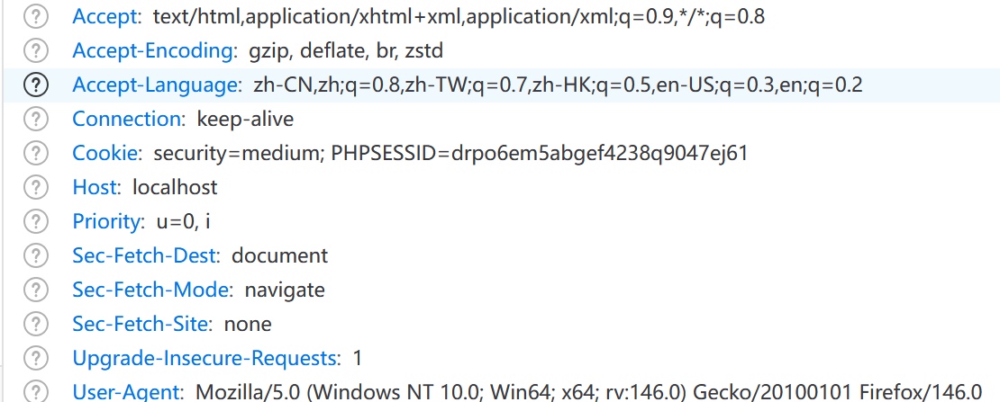

- 添加 Referer 

浏览器 “从一个 HTTP(S) 网页跳转到另一个网页” 时

- 不添加Referer

浏览器地址栏直接输入URL或者打开一个本地文件时


思路：在请求头加入Referer字段并写入localhost

打开Burp Suite => 开启拦截 => 粘贴构造好的URL并刷新页面 => 添加Referer: localhost => 放行

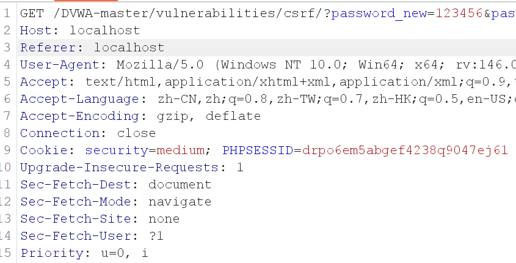

密码修改成功

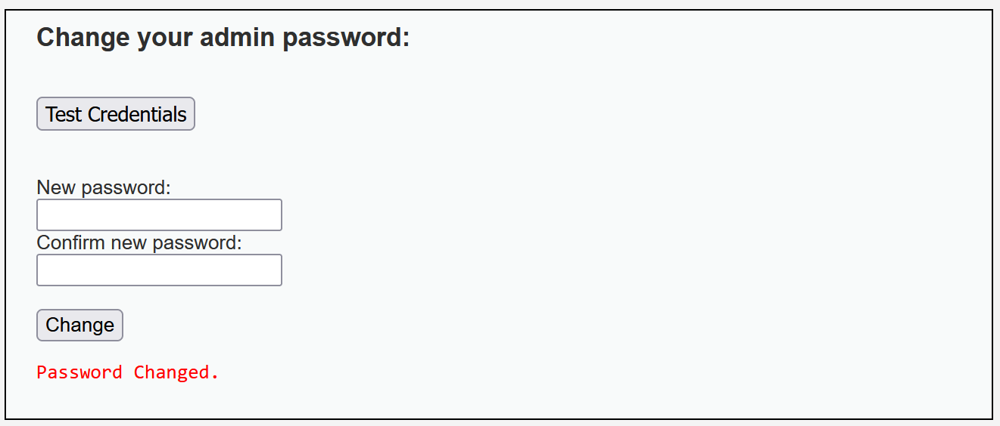


## High

### 源码分析

```php
<?php

$change = false;
$request_type = "html";
$return_message = "Request Failed";

if ($_SERVER['REQUEST_METHOD'] == "POST" && array_key_exists ("CONTENT_TYPE", $_SERVER) && $_SERVER['CONTENT_TYPE'] == "application/json") {
    $data = json_decode(file_get_contents('php://input'), true);
    $request_type = "json";
    if (array_key_exists("HTTP_USER_TOKEN", $_SERVER) &&
        array_key_exists("password_new", $data) &&
        array_key_exists("password_conf", $data) &&
        array_key_exists("Change", $data)) {
        $token = $_SERVER['HTTP_USER_TOKEN'];
        $pass_new = $data["password_new"];
        $pass_conf = $data["password_conf"];
        $change = true;
    }
} else {
    if (array_key_exists("user_token", $_REQUEST) &&
        array_key_exists("password_new", $_REQUEST) &&
        array_key_exists("password_conf", $_REQUEST) &&
        array_key_exists("Change", $_REQUEST)) {
        $token = $_REQUEST["user_token"];
        $pass_new = $_REQUEST["password_new"];
        $pass_conf = $_REQUEST["password_conf"];
        $change = true;
    }
}

if ($change) {
    // Check Anti-CSRF token
    checkToken( $token, $_SESSION[ 'session_token' ], 'index.php' );

    // Do the passwords match?
    if( $pass_new == $pass_conf ) {
        // They do!
        $pass_new = mysqli_real_escape_string ($GLOBALS["___mysqli_ston"], $pass_new);
        $pass_new = md5( $pass_new );

        // Update the database
        $current_user = dvwaCurrentUser();
        $insert = "UPDATE `users` SET password = '" . $pass_new . "' WHERE user = '" . $current_user . "';";
        $result = mysqli_query($GLOBALS["___mysqli_ston"],  $insert );

        // Feedback for the user
        $return_message = "Password Changed.";
    }
    else {
        // Issue with passwords matching
        $return_message = "Passwords did not match.";
    }

    mysqli_close($GLOBALS["___mysqli_ston"]);

    if ($request_type == "json") {
        generateSessionToken();
        header ("Content-Type: application/json");
        print json_encode (array("Message" =>$return_message));
        exit;
    } else {
        echo "<pre>" . $return_message . "</pre>";
    }
}

// Generate Anti-CSRF token
generateSessionToken();

?> 
```

增加了token值的校验

generateSessionToken() 函数用于更新Token值

- 访问 CSRF High 页面时 → generateSessionToken() 被调用 → 生成一个随机token值

  - 存到服务器session中

    $_SESSION['session_token'] = 随机值

  - 同步写到页面里

    <input type="hidden" name="user_token" value="0a3f2c3a...">

- 提交更改密码请求时

  - 提交页面隐藏字段 user_token
  - 校验：请求里携带的 token与服务器 session 中保存的 token

- 更改密码请求成功时

  - 调用generateSessionToken() → 更新token值


### 漏洞利用

思路：正常更改密码 => token值更新 => 在BP中查看隐藏字段token值 => 构造包含新token值的URL

进行一次正常操作获取URL格式 => 后续构造URL

```
http://localhost/DVWA-master/vulnerabilities/csrf/?password_new=111111&password_conf=111111&Change=Change&user_token=f5b27d7c680abfe27a31ca6af37f3c76#
```

BP开拦截 => 正常修改密码

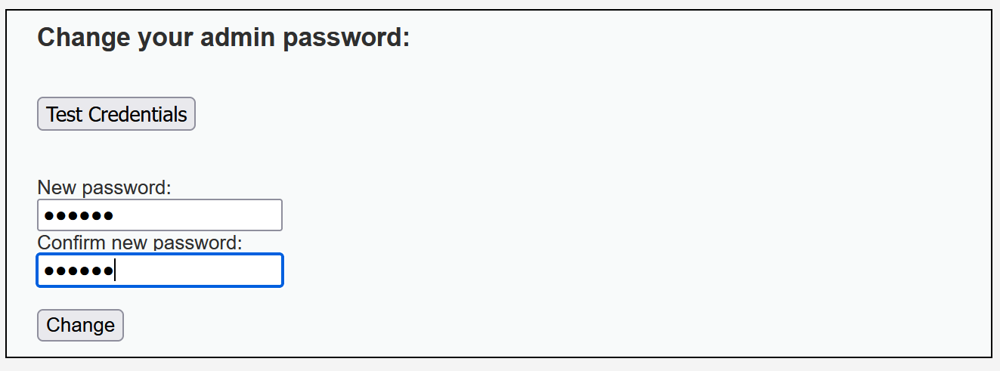

抓包 => 发送到重放器发送 => 在响应包中Raw中查看最新的token值

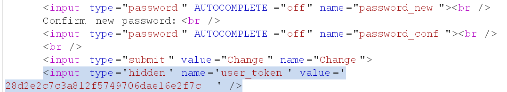

构造URL

```
http://localhost/DVWA-master/vulnerabilities/csrf/?password_new=111111&password_conf=111111&Change=Change&user_token=28d2e2c7c3a812f5749706dae16e2f7c#
```

先关闭浏览器在关闭BP拦截！（先关闭BP拦截会导致页面刷新 => token值会再一次更新）

打开新页面粘贴URL

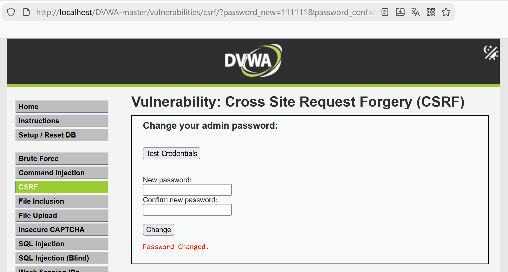

密码修改成功

### 漏洞利用第一步无法实现

**这一关卡模拟的真实场景理解**

1、用户登录网站，网站保存登录信息

2、攻击者构造URL，想诱导用户使用保存着登录信息的浏览器去点击该URL

3、目的达成，用户密码改变，攻击者盗取了用户的账户

**我的攻击流程中存在一个致命错误**

我抓不到包啊！！！

用户的流量不可能无端端流入我的BP中

**这让我对于CSRF ”跨站“ 有了更深刻的理解**

High 等级下已经无法通过“构造请求并诱导”这种纯 CSRF的方式绕过 Token 防护

构造合法的请求无法实现

## Impossible

Impossible的token检验机制和High的token检验机制相似

Impossible：请求携带 token与 session_token 比对

但增添了当前密码的校验 $pass_curr = $_GET[ 'password_current' ]; 

当前密码无法获取则不可能绕过 

# 文件包含（File Inclusion）

## Low

### 源码分析

### 漏洞利用

## Medium

### 源码分析

### 漏洞利用

## High

### 源码分析

### 漏洞利用

## Impossible

### 源码分析

### 漏洞利用

# 文件上传（File Upload）

## Low

### 源码分析

### 漏洞利用

## Medium

### 源码分析

### 漏洞利用

## High

### 源码分析

### 漏洞利用

## Impossible

### 源码分析

### 漏洞利用

# 不安全的验证码（Insecure CAPTCHA）

## Low

### 源码分析

### 漏洞利用

## Medium

### 源码分析

### 漏洞利用

## High

### 源码分析

### 漏洞利用

## Impossible

### 源码分析

### 漏洞利用

# SQL 注入（SQL Injection）

## Low

### 源码分析

### 漏洞利用

## Medium

### 源码分析

### 漏洞利用

## High

### 源码分析

### 漏洞利用

## Impossible

### 源码分析

### 漏洞利用

# SQL 注入（盲注 / SQL Injection Blind）

## Low

### 源码分析

### 漏洞利用

## Medium

### 源码分析

### 漏洞利用

## High

### 源码分析

### 漏洞利用

## Impossible

### 源码分析

### 漏洞利用

# 弱会话 ID（Weak Session IDs）

## Low

### 源码分析

### 漏洞利用

## Medium

### 源码分析

### 漏洞利用

## High

### 源码分析

### 漏洞利用

## Impossible

### 源码分析

### 漏洞利用

# DOM 型 XSS（XSS - DOM）

## Low

### 源码分析

### 漏洞利用

## Medium

### 源码分析

### 漏洞利用

## High

### 源码分析

### 漏洞利用

## Impossible

### 源码分析

### 漏洞利用

# 反射型 XSS（XSS - Reflected）

## Low

### 源码分析

### 漏洞利用

## Medium

### 源码分析

### 漏洞利用

## High

### 源码分析

### 漏洞利用

## Impossible

### 源码分析

### 漏洞利用

# 存储型 XSS（XSS - Stored）

## Low

### 源码分析

```php
<?php

if( isset( $_POST[ 'btnSign' ] ) ) {
	// Get input
	$message = trim( $_POST[ 'mtxMessage' ] );
	$name    = trim( $_POST[ 'txtName' ] );

	// Sanitize message input
	$message = stripslashes( $message );
	$message = ((isset($GLOBALS["___mysqli_ston"]) && is_object($GLOBALS["___mysqli_ston"])) ? mysqli_real_escape_string($GLOBALS["___mysqli_ston"],  $message ) : ((trigger_error("[MySQLConverterToo] Fix the mysql_escape_string() call! This code does not work.", E_USER_ERROR)) ? "" : ""));

	// Sanitize name input
	$name = ((isset($GLOBALS["___mysqli_ston"]) && is_object($GLOBALS["___mysqli_ston"])) ? mysqli_real_escape_string($GLOBALS["___mysqli_ston"],  $name ) : ((trigger_error("[MySQLConverterToo] Fix the mysql_escape_string() call! This code does not work.", E_USER_ERROR)) ? "" : ""));

	// Update database
	$query  = "INSERT INTO guestbook ( comment, name ) VALUES ( '$message', '$name' );";
	$result = mysqli_query($GLOBALS["___mysqli_ston"],  $query ) or die( '<pre>' . ((is_object($GLOBALS["___mysqli_ston"])) ? mysqli_error($GLOBALS["___mysqli_ston"]) : (($___mysqli_res = mysqli_connect_error()) ? $___mysqli_res : false)) . '</pre>' );

	//mysql_close();
}

?>

```

- if( isset( $_POST[ 'btnSign' ] ) ) 

  判断 `$_POST` 超全局数组中是否存在名为 `btnSign` 的字段，用来确认表单是否被提交。

  - isset()

    PHP 内置函数 判断一个变量是否已定义且不为 `null`

- $message = trim( $_POST[ 'mtxMessage' ] );

  去除 mtxMessage 首尾的空白字符

  - trim()

    PHP 内置函数 去除字符串两端的空格、换行符、制表符等

- $message = stripslashes( $message );

  对 `$message` 中的反斜杠进行去除，防止转义字符重复存在。

  - stripslashes()

    PHP 内置函数 删除字符串中的反斜杠 `\` 兼容早期 PHP 的 `magic_quotes_gpc` 机制

- $message = ((isset(...) && is_object(...)) ? mysqli_real_escape_string(...) : (...);

  对 `$message` 进行 SQL 转义

  - is_object()

    内置函数 判断变量是否为对象 这里用于确认数据库连接是否有效

  - mysqli_real_escape_string()

    PHP MySQLi 扩展函数 对字符串进行 SQL 特殊字符转义（防 SQL 注入）

  - trigger_error()

    PHP 内置函数 手动触发一个 PHP 错误

**low等级对于XSS注入没有做任何的防御动作**

### 漏洞利用

尝试

```
<script>alert('1')</script>
```

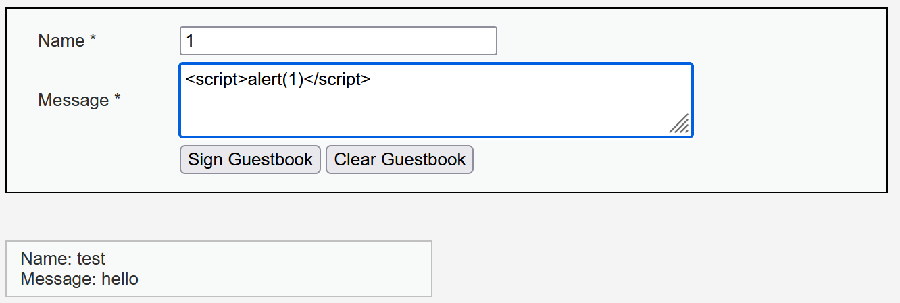

出现弹框 脚本执行成功

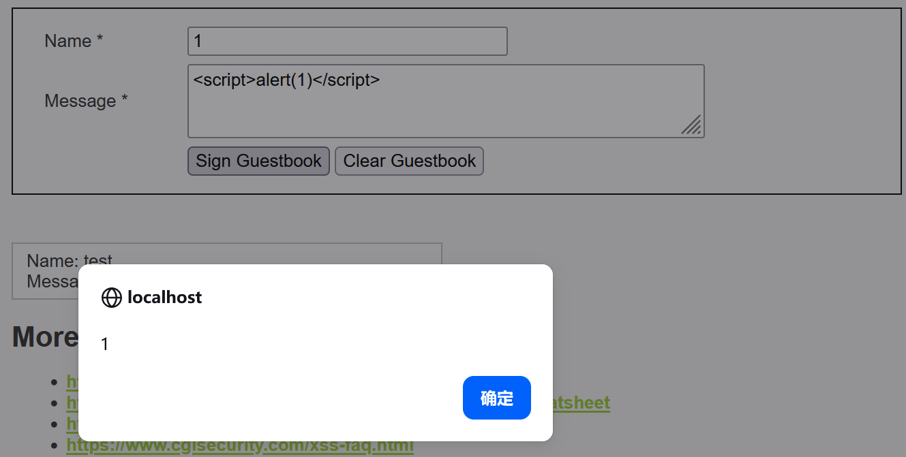

表单显示内容为空 因为浏览器将<script>标签识别为可执行代码

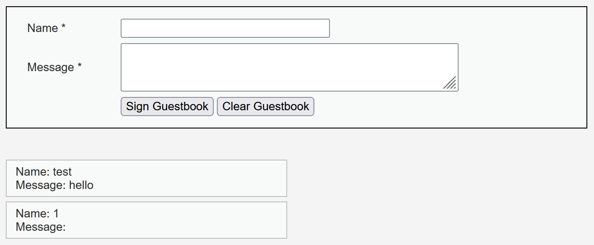

### 小插曲 死循环

我又尝试了<input>两个标签

```

```

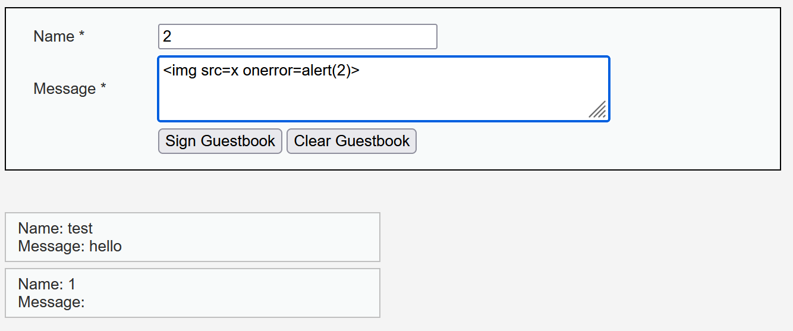

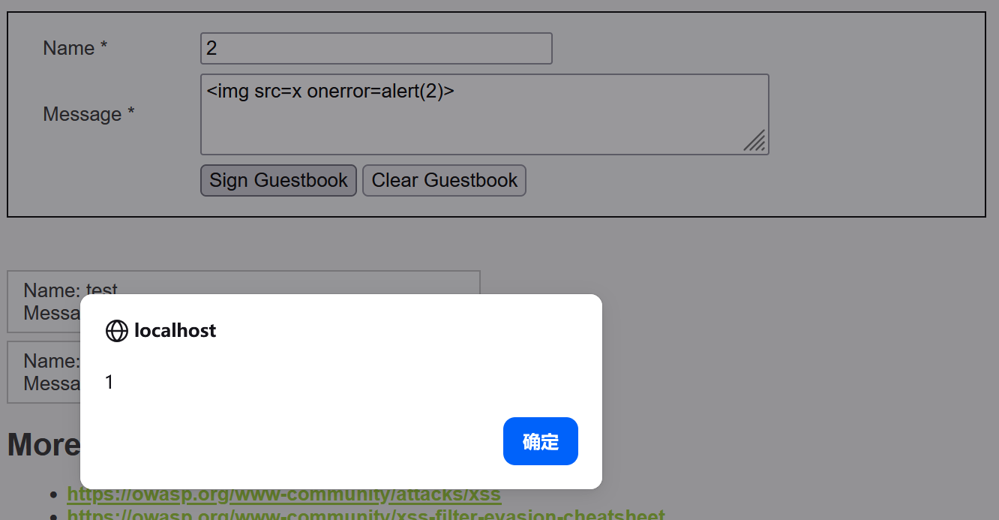


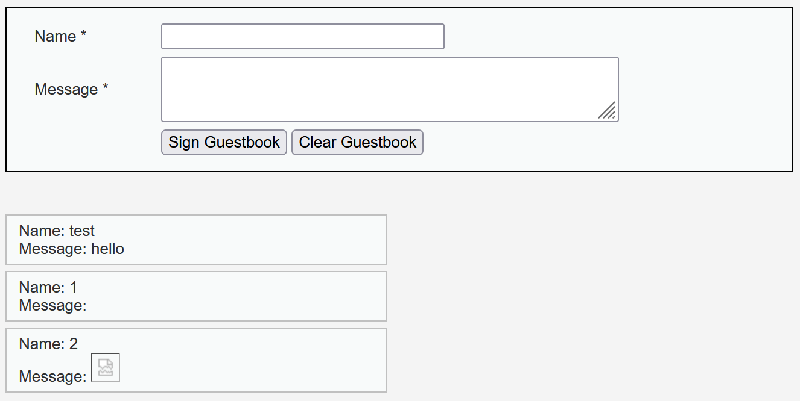

先后弹窗12结果与预想相同

```
<input onfocus=alert(3) autofocus>
```

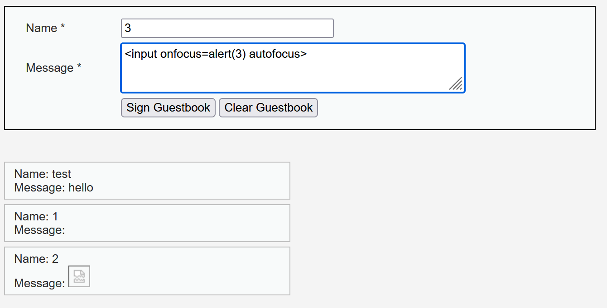

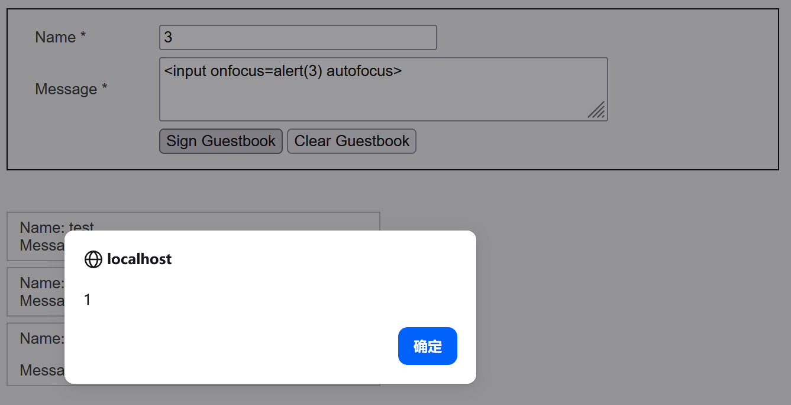

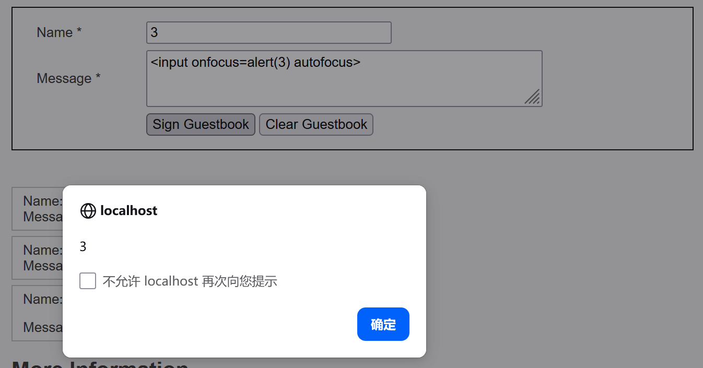

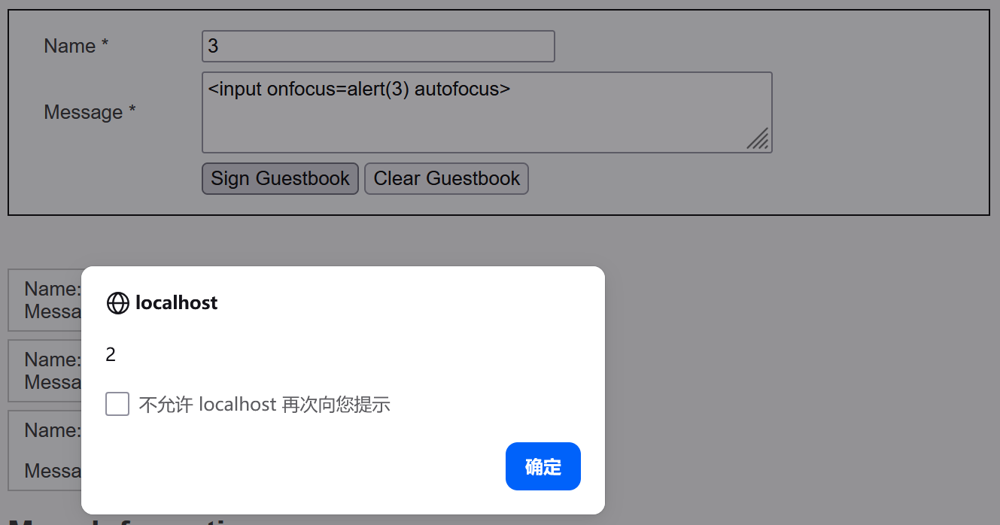

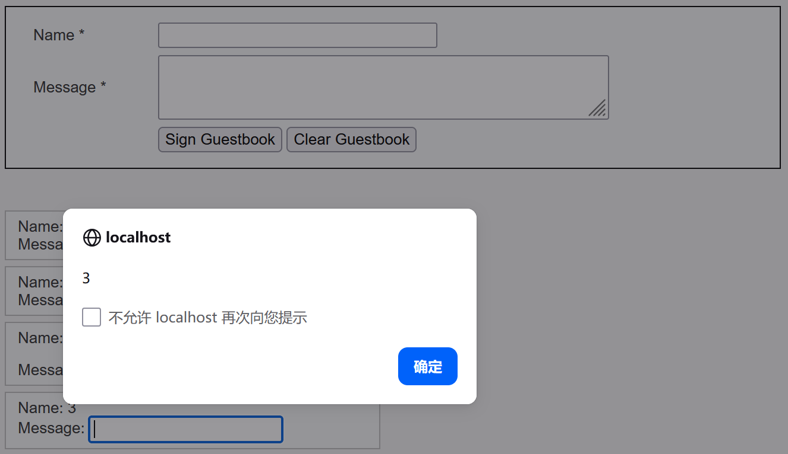

弹框13233333 并且陷入死循环 结果与预想先后弹窗123不同

原因：

- autofocus 浏览器在页面加载完成后，会自动把焦点放到这个 input 上

- onfocus=alert(3) 每一次元素获得焦点，都会触发

alert 本身会“打断”焦点状态

```
13233333顺序解释：
<script> → alert(1)
<input autofocus> → 获得焦点 → alert(3)
 → 图片加载失败 → alert(2)
alert 关闭 → 焦点回到 input → alert(3)
再关闭 → 再 focus → alert(3)
无限重复……
进入：
onfocus + autofocus + alert 浏览器焦点抖动死循环
```


## Medium

### 源码分析

```php
<?php

if( isset( $_POST[ 'btnSign' ] ) ) {
    // Get input
    $message = trim( $_POST[ 'mtxMessage' ] );
    $name    = trim( $_POST[ 'txtName' ] );

    // Sanitize message input
    $message = strip_tags( addslashes( $message ) );
    $message = ((isset($GLOBALS["___mysqli_ston"]) && is_object($GLOBALS["___mysqli_ston"])) ? mysqli_real_escape_string($GLOBALS["___mysqli_ston"],  $message ) : ((trigger_error("[MySQLConverterToo] Fix the mysql_escape_string() call! This code does not work.", E_USER_ERROR)) ? "" : ""));
    $message = htmlspecialchars( $message );

    // Sanitize name input
    $name = str_replace( '<script>', '', $name );
    $name = ((isset($GLOBALS["___mysqli_ston"]) && is_object($GLOBALS["___mysqli_ston"])) ? mysqli_real_escape_string($GLOBALS["___mysqli_ston"],  $name ) : ((trigger_error("[MySQLConverterToo] Fix the mysql_escape_string() call! This code does not work.", E_USER_ERROR)) ? "" : ""));

    // Update database
    $query  = "INSERT INTO guestbook ( comment, name ) VALUES ( '$message', '$name' );";
    $result = mysqli_query($GLOBALS["___mysqli_ston"],  $query ) or die( '<pre>' . ((is_object($GLOBALS["___mysqli_ston"])) ? mysqli_error($GLOBALS["___mysqli_ston"]) : (($___mysqli_res = mysqli_connect_error()) ? $___mysqli_res : false)) . '</pre>' );

    //mysql_close();
}

?> 
```

- $message = strip_tags( addslashes( $message ) );

  删除所有 HTML 标签

  - addslashes()

    PHP 内置函数 添加反斜杠 ‘ “ \ NULL

  - strip_tags()

    删除字符串中的所有 HTML 和 PHP 标签

- $message = htmlspecialchars( $message );

  将 `$message` 中的 HTML 特殊字符转换为对应的 HTML 实体

  - htmlspecialchars()

    PHP 内置函数 将字符串中的 HTML 特殊字符 转换为 HTML 实体，从而使其在页面中只作为普通文本显示，而不会被浏览器当成 HTML 或 JavaScript 执行。

    ```
    用户输入
    <script>alert(1)</script>
    转换后
    &lt;script&gt;alert(1)&lt;/script&gt
    ```

- $name = str_replace( '<script>', '', $name );

  删除用户输入的 name 中的 `<script>` 标签

**对于message**

​	**过滤所有 HTML / PHP 标签**

​	**转义HTML 特殊字符**

**对于name**

​	**删除<script>字符串**

### 漏洞利用

**对于message** **所有HTML和PHP标签都会被过滤**

```
<script>alert(1)</script>
```

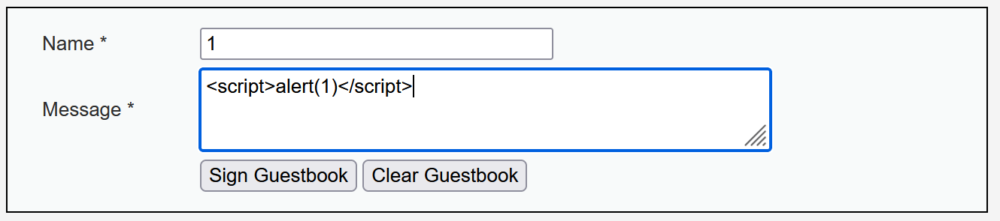

```

```

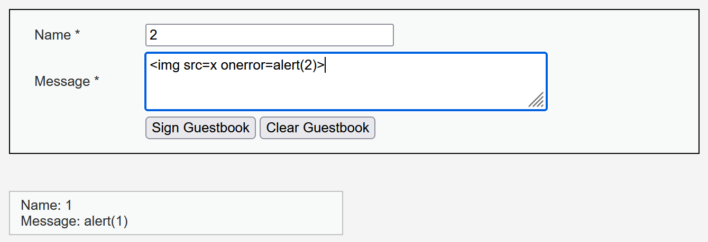

```
<scr ipt>alert(3)</scr ipt> 添加空格处理
```

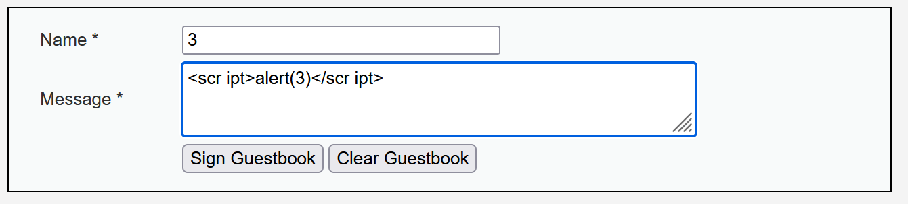

```
<ScRiPt>alert(4)</ScRiPt> 大小写混用
```

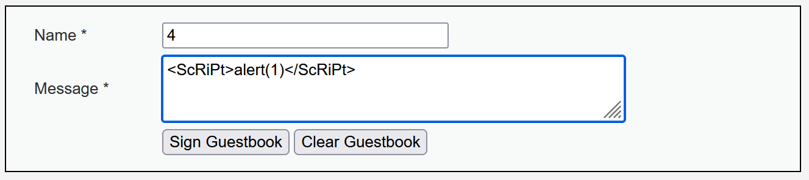

**和预想结果一致，全部都被识别为标签过滤**

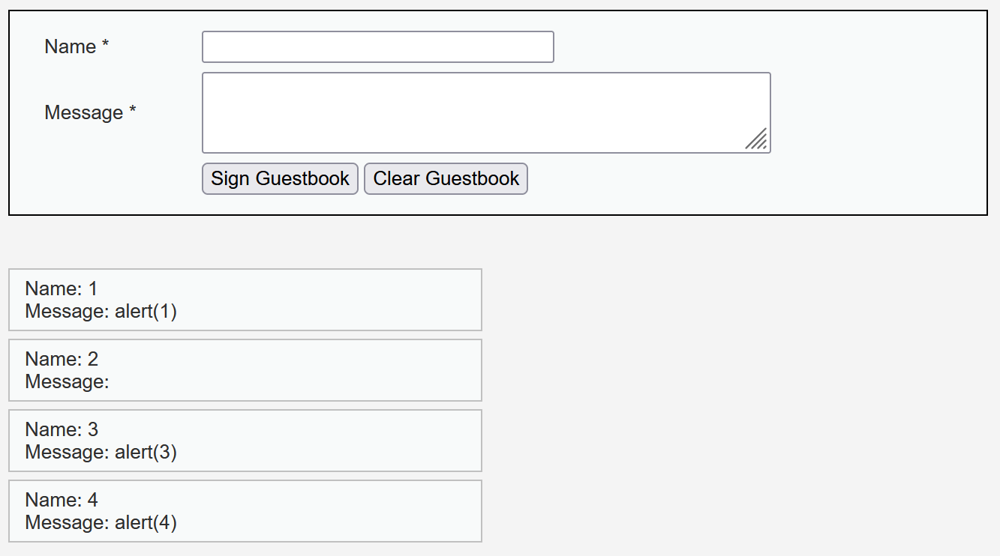

**对于name 删除了<script>字符串**

前端长度限制10

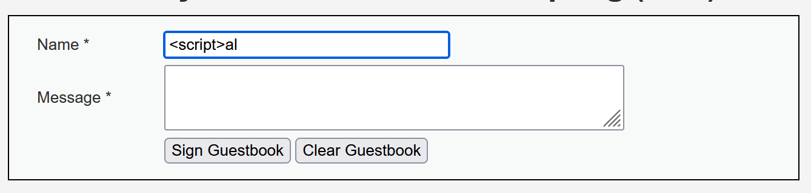

打开前端将长度限制10改为100

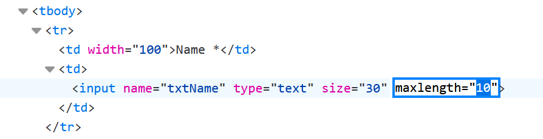

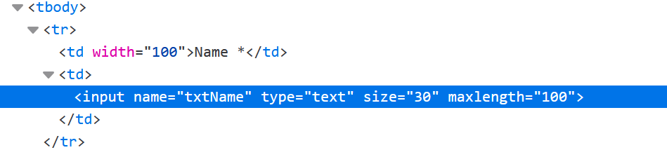

- 大小写混用绕过

```
<Script>alert(1)</Script>
```

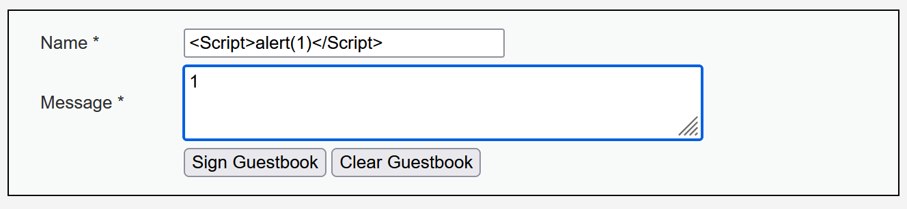

注入成功

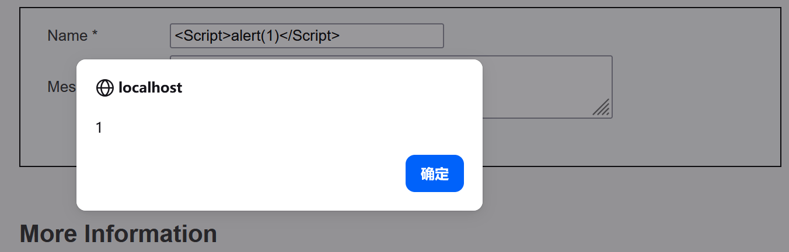

- 双写绕过

```
<scr<script>ipt>alert(1)</scr<script>ipt>
```

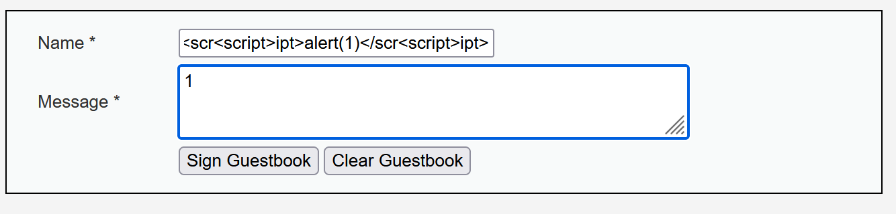

注入成功


## High

### 源码分析

```php
<?php

if( isset( $_POST[ 'btnSign' ] ) ) {
    // Get input
    $message = trim( $_POST[ 'mtxMessage' ] );
    $name    = trim( $_POST[ 'txtName' ] );

    // Sanitize message input
    $message = ...

    // Sanitize name input
    $name = preg_replace( '/<(.*)s(.*)c(.*)r(.*)i(.*)p(.*)t/i', '', $name );
    $name = ...

    // Update database
    $query  = "INSERT INTO guestbook ( comment, name ) VALUES ( '$message', '$name' );";
    $result = mysqli_query($GLOBALS["___mysqli_ston"],  $query ) or die( '<pre>' . ((is_object($GLOBALS["___mysqli_ston"])) ? mysqli_error($GLOBALS["___mysqli_ston"]) : (($___mysqli_res = mysqli_connect_error()) ? $___mysqli_res : false)) . '</pre>' );

    //mysql_close();
}

?> 
```

相比于Medium，High等级对于name有更严格的过滤，其它的处理都不变

```
$name = preg_replace( '/<(.*)s(.*)c(.*)r(.*)i(.*)p(.*)t/i', '', $name );
```

在 `< >` 中，字符顺序能拼出 s c r i p t，就删掉整段

不过用其他标签即可绕过

### 漏洞利用

与Medium流程相同

打开前端将长度限制10改为100

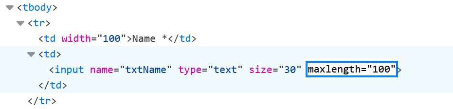

- 使用其他标签

```

```

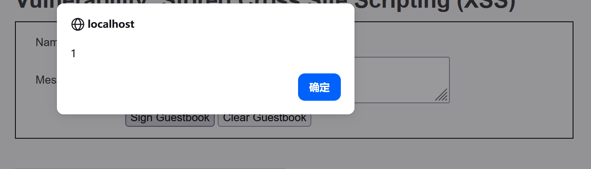

注入成功

## Impossible

**Impossible等级里 name采用了和message一样严格的过滤机制 那就没有小后门可以钻了**


# CSP 绕过（CSP Bypass）

## Low

### 源码分析

### 漏洞利用

## Medium

### 源码分析

### 漏洞利用

## High

### 源码分析

### 漏洞利用

## Impossible

### 源码分析

### 漏洞利用

# JavaScript 攻击（JavaScript）

## Low

### 源码分析

### 漏洞利用

## Medium

### 源码分析

### 漏洞利用

## High

### 源码分析

### 漏洞利用

## Impossible

### 源码分析

### 漏洞利用
